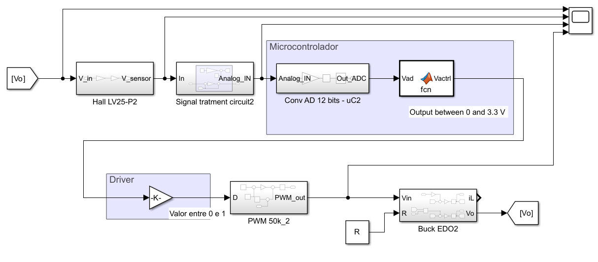
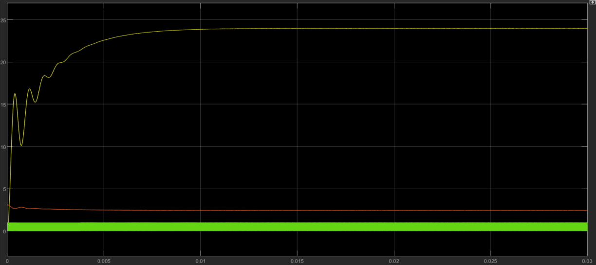
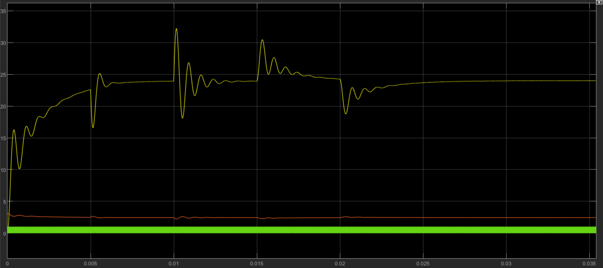

# Discrete Control Design and Analysis for a DC-DC Buck Converter


## Overview

This repository contains the complete analysis, modeling, and design of a digital controller for a DC-DC Buck (step-down) converter. The project spans from the mathematical derivation of the plant's transfer functions to the simulation of a realistic implementation, including a sensor, signal conditioning circuit, A/D converter, and the PID control algorithm in a simulated microcontroller.

The main objective was to design a discrete PID controller to regulate the converter's output voltage at 24V, meeting specific settling time and overshoot requirements.

## ✨ Key Project Stages

* **Mathematical Modeling:** Derivation of the state-space equations and continuous transfer functions ( $G_v(s)$ and $G_i(s)$ ) for the Buck converter.
* **Open-Loop Analysis:** Simulation of the plant in Simulink to characterize the step response and the voltage and current ripple.
* **Discrete Control Design:**
    * Discretization of the continuous plant using the ZOH (Zero-Order Hold) method.
    * Design of a digital PID controller using the MATLAB SISOTOOL to meet performance requirements.
    * Conversion of the designed controller into a difference equation for software implementation.
* **Realistic Simulation:** Implementation of a complete simulation model that includes:
    * A Hall effect voltage sensor (LV25-P).
    * A signal conditioning circuit with operational amplifiers.
    * Quantization of a 12-bit Analog-to-Digital Converter (ADC).
    * The PID control algorithm implemented in a `MATLAB Function` block, simulating a microcontroller.
* **Robustness Test:** Evaluation of the controller's ability to reject disturbances in the load and input voltage.

## 📂 Repository Structure

.

├── img/

│ ├── realistic_simulation.png

│ ├── realistic_simulation_response.png

│ └── robustness_test_response.png

├── matlab/

│ └── init.m

├── simulink/

│ └── buck.slx

├── CalcValoresR.py

├── project_report.pdf

└── README.md

* **`matlab/init.m`**: MATLAB script that must be run first. It defines all circuit parameters (L, C, R, Vi), calculates the continuous and discrete transfer functions, and loads the variables into the MATLAB workspace.
* **`simulink/buck.slx`**: Simulink file containing all simulation models:
    1.  Open-loop analysis.
    2.  Ripple analysis with PWM.
    3.  Closed-loop system with the discrete PID controller.
    4.  Complete realistic simulation with sensor and microcontroller.
* **`python/resistor_calculator.py`**: Python script used to calculate the resistor values for the signal conditioning circuit.
* **`project_report.pdf`**: The complete project report (in Portuguese), containing all theoretical background, mathematical development, results, and analysis.

## 🚀 How to Use

### Prerequisites

* **MATLAB** (version R2021b or newer)
* **Simulink**
* **Control System Toolbox™**
* **Python 3** (with the `sympy` library installed, if you wish to run the symbolic calculation script).

### Simulation Instructions

1.  **Clone the Repository:**
    ```bash
    git clone [https://github.com/JacksonJoseG/Simulink-buck-model.git](https://github.com/JacksonJoseG/Simulink-buck-model.git)
    cd your-repository
    ```
2.  **Run the Initialization Script:**
    * Open MATLAB.
    * Navigate to the `matlab/` folder.
    * Run the `init.m` script. This will load all necessary variables into the workspace.
    ```matlab
    >> run init.m
    ```
3.  **Open the Simulink Model:**
    * Navigate to the `simulink/` folder.
    * Open the `buck.slx` file.
4.  **Run the Simulation:**
    * Inside Simulink, you will find the different models described in the PDF.
    * Run the desired simulation scenario to view the results.

## 📈 Key Results

The project culminated in a discrete PID controller that successfully met the performance requirements.

**Discrete Controller Transfer Function:**
$C(z) = \frac{0.0413z^2 - 0.0739z + 0.0357}{z^2 - z}$

**Difference Equation for Implementation:**
$u[k] = u[k-1] + 0.0413e[k] - 0.0739e[k-1] + 0.0357e[k-2]$

**Closed-Loop System Simulink Design (Realistic Simulation):**
The final model, including the sensor and ADC, demonstrated that the controller is capable of regulating the output voltage at 24V in a stable manner.



**Closed-Loop System Response (Realistic Simulation):**



**Robustness Test:**
The controller proved to be robust, rejecting disturbances of 50% in the load and 30% in the input voltage, while maintaining the regulated output voltage on steady state.




---

*This README was generated based on the project's technical report. For an in-depth analysis, please refer to the `project_report.pdf` file.*
